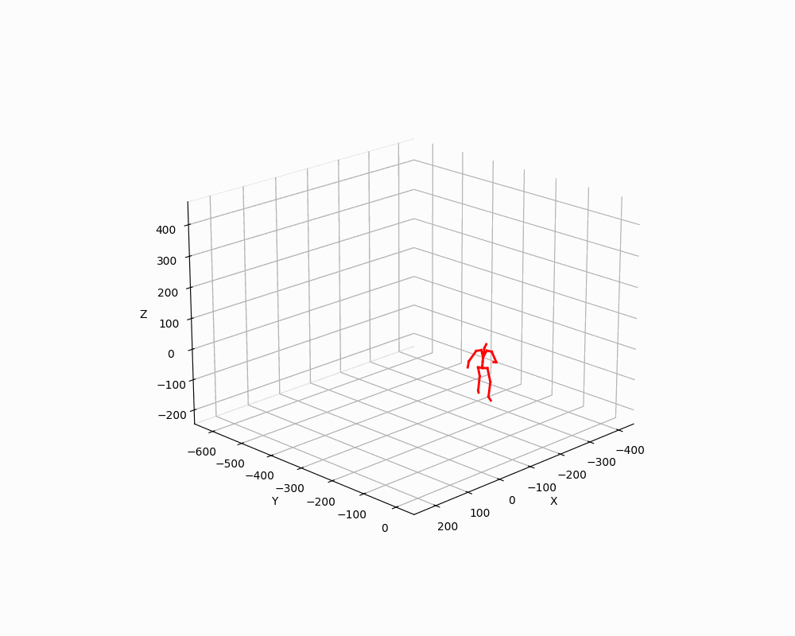
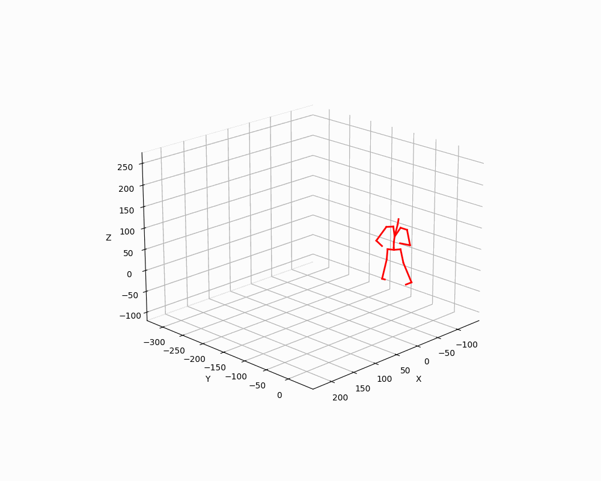
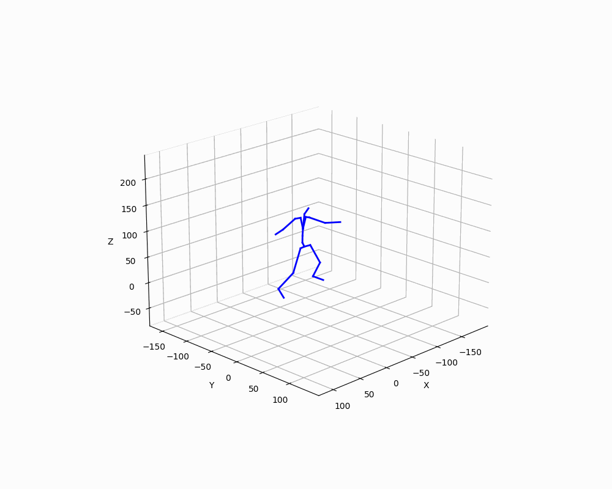

The repo is an simple demo showing how to use flow matching (you may also use diffusion model) to 
do MIB (motion in-between) tasks. The task is to use (68=128-30-30) frames to connect the given 30 head 
frames and 30 tail frames. We expect the completed (68=128-30-30) frames to be sufficiently natural and 
smoothly connect the head and tail frames. See `inpaint.py` for details.

1. create python environment

```python -m venv venv```

2. activate python environment

```source venv/Scripts/activate # for windows```

```source venv/bin/activate # for linux```

3. install packages

```bash install.sh```

4. download lafan1 motion data and place bvh files under `datasets/lafan1`

```https://github.com/ubisoft/ubisoft-laforge-animation-dataset.git```

5. preprocess data

```python preprocess.py```

6. training

```python train.py```

7. generate motions and save them under `videos`

```python inference.py```

8. Motion in between (inpainting), completed motions are saved under `inpainting`

```python inpaint.py```

9. motion generation samples

<div style="display: flex; flex-wrap: wrap; justify-content: space-around; align-items: flex-start;">
  
  
  
  
</div>

10. motion inpainting samples

<div style="display: flex; flex-wrap: wrap; justify-content: space-around; align-items: flex-start;">
  
  
  
  
</div>
