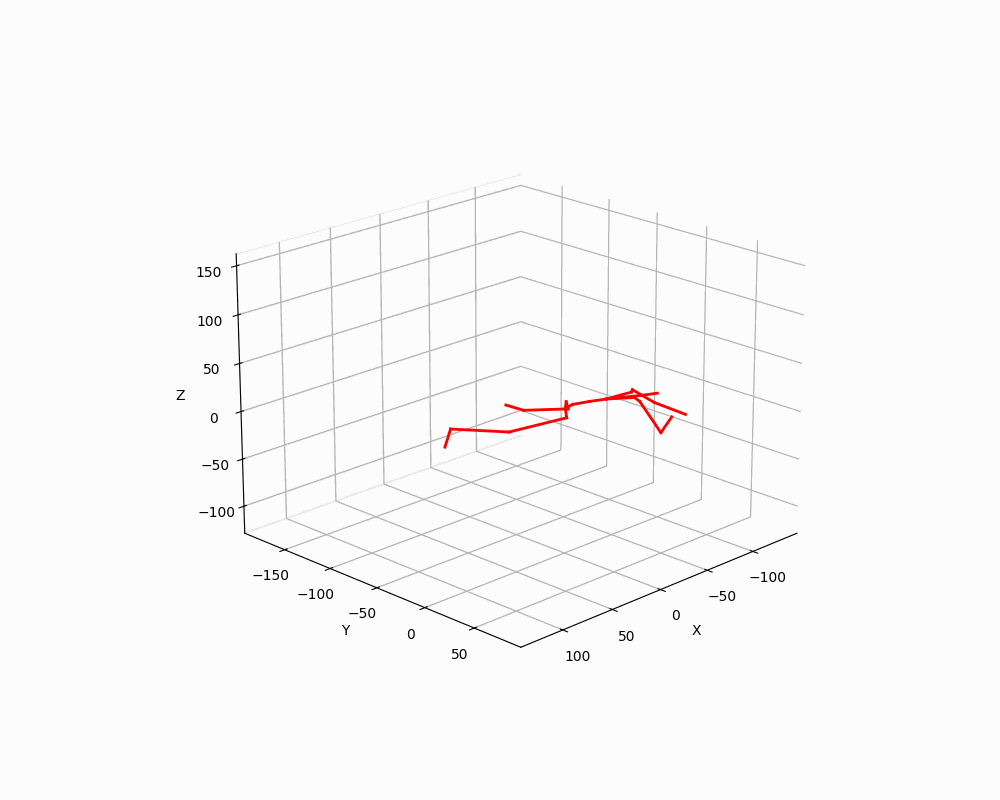
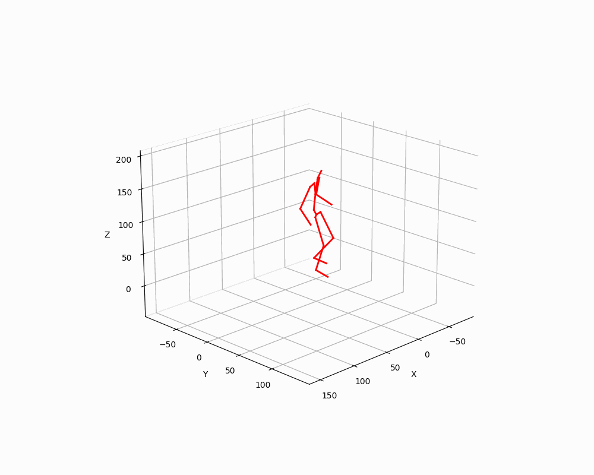
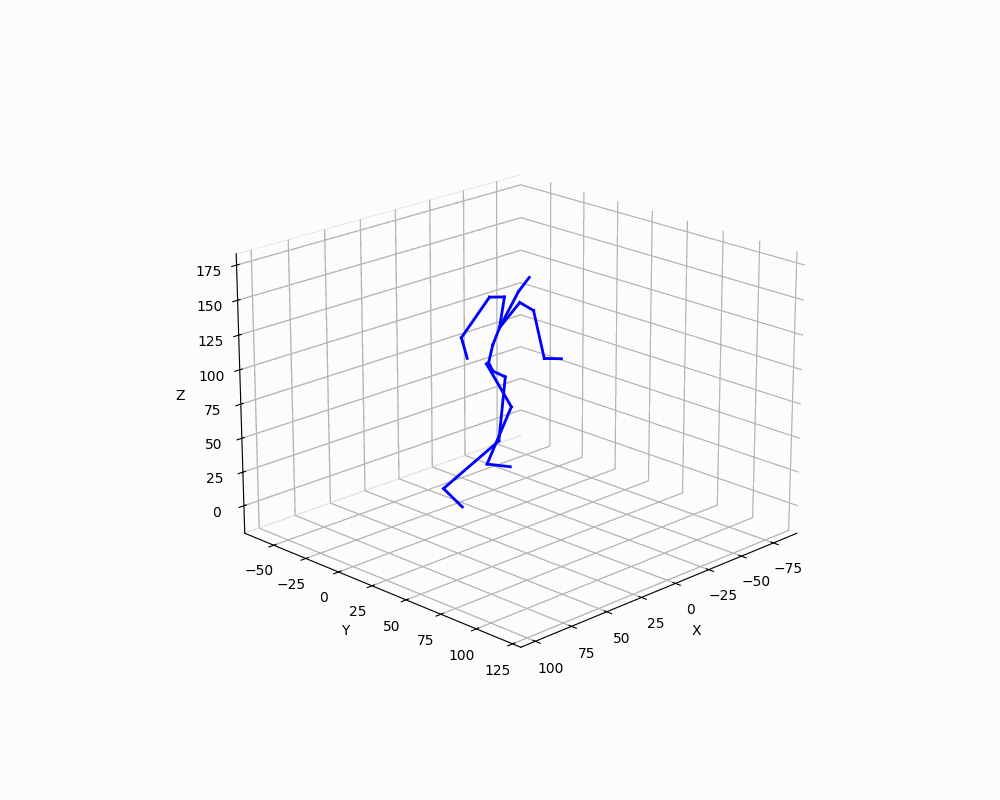
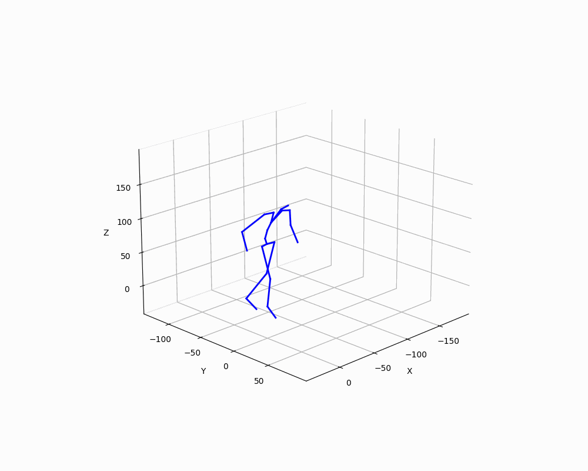

The repo is an simple demo showing how to use flow matching (you may also use diffusion model) 
to do MIB (motion in-between) tasks. The specific task is to use 68 (=128-30-30) frames to 
connect the given 30 head frames and 30 tail frames. We expect the frames completed in the 
middle to be sufficiently natural and smooth connecting the given head and tail. We train a 
flow matching model to generate motion from noise and we borrow the technique called 
"inpainting" from image completion to generate the in-between frames conditioned on the 
given head and tail. See `inpaint.py` for details. There are many other techniques to improve 
the generated in-between frames and the motion as a whole, but they are beyond the scope and 
purpose of this repo and thus will not be included here。 

1. Create Python Environment

```bash
python -m venv venv
```

2. Activate Python Environment

```bash
source venv/Scripts/activate # for windows
```

```bash
source venv/bin/activate # for linux
```

3. Install Packages

```bash
bash install.sh
```

4. Download Motion Data

downloaded lafan1 bvh files should be placed under `datasets/lafan1`

```
https://github.com/ubisoft/ubisoft-laforge-animation-dataset.git
```

5. Preprocess Data

```bash
python preprocess.py
```

6. Training

```bash
python train.py
```

7. Generate Motions
generated motions are saved under `videos`

```bash
python inference.py
```

8. Motion in-between (inpainting)
completed motions are saved under `inpainting`

```bash
python inpaint.py
```

9. Generated Motion Samples.
These samples are generated by a trained model with `d_model=1024` and `dim_feedforward=2048`. 
Though the trained model is 194 MB, it's too slow to upload the model to Github. So I uploaded 
a smaller one which is trained with `d_model=512` and `dim_feedforward=1024`. 

<div style="display: flex; flex-wrap: wrap; justify-content: space-around; align-items: flex-start;">
  
  
  
  
</div>

10. Inpainted Motion Samples
Given the first 20 (head) and last 20 (tail) frames, the in-between 88 frames are generated 
to connect the head and tail. The given frames are painted in blue color, and the generated 
in-between frames are painted in red color.

<div style="display: flex; flex-wrap: wrap; justify-content: space-around; align-items: flex-start;">
  
  
  
  
</div>
